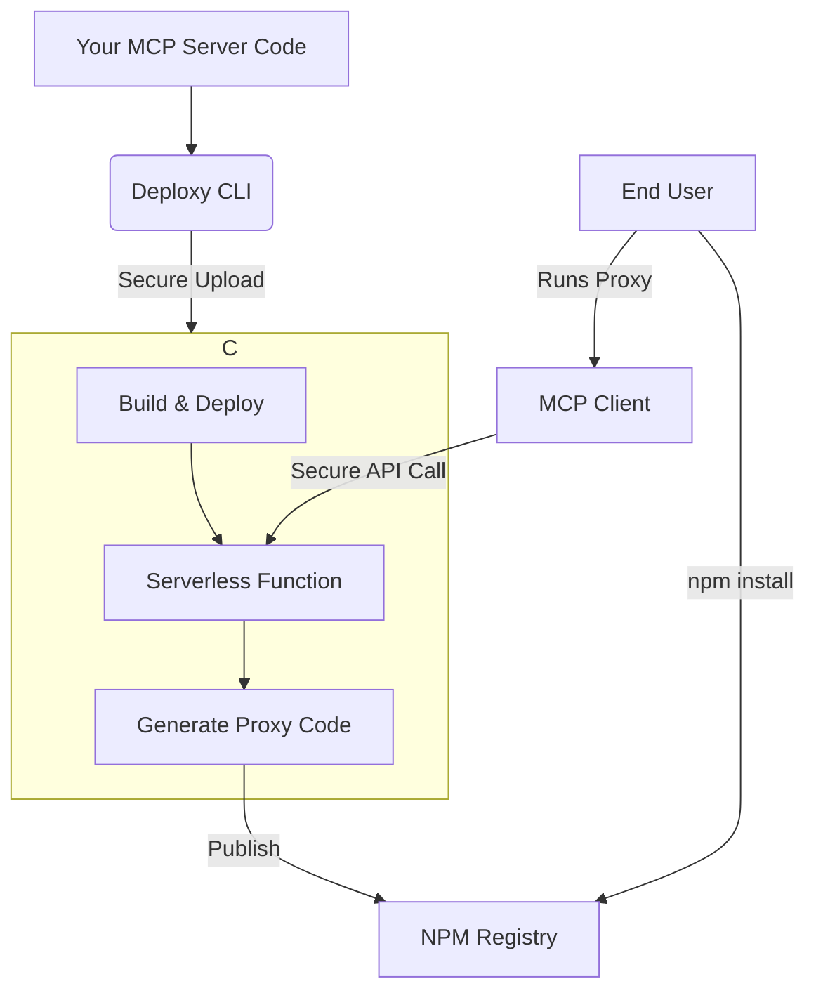

# Introduction to Deploxy

<Callout type="info" title="What You'll Learn">
  In this guide, you'll learn about Deploxy's core concepts, how it works, and why it's the perfect solution for
  deploying private MCP servers.
</Callout>

Welcome to Deploxy, the premier platform for deploying your MCP (Model Context Protocol) servers to serverless infrastructure while keeping your source code private and secure.

## What is Deploxy?

Deploxy is a comprehensive deployment platform that allows developers to:

  <FeatureCard
    icon="Shield"
    title="Deploy MCP servers privately"
    description="Your source code remains secure on our servers, never exposed to end-users."
  />
  <FeatureCard
    icon="Globe"
    title="Distribute lightweight proxies"
    description="Users install minimal proxy packages from NPM that securely connect to your hosted logic."
  />
  <FeatureCard
    icon="Zap"
    title="Scale automatically"
    description="Leverage serverless infrastructure that handles traffic spikes without manual intervention."
  />
  <FeatureCard
    icon="Code"
    title="Focus on Your Logic"
    description="No need to build a separate backend for secure tool calls or database connections."
  />

## How It Works

The Deploxy platform follows a simple but powerful architecture:

<Step number={1} title="You Write Your MCP Server">
  Build your MCP server with all your business logic, database connections, and private functionality. This runs
  entirely in Deploxy's secure cloud environment.
</Step>

<Step number={2} title="Deploy with the Deploxy CLI">
  Using our CLI tool, your code is securely uploaded to our infrastructure where it's built and deployed as a serverless
  function.
</Step>

<Step number={3} title="We Generate a Proxy Package">
  Deploxy automatically creates a lightweight NPM package that acts as a proxy to your private server. This proxy is
  what you'll publish for your users.
</Step>

<Step number={4} title="Users Install the Proxy">
  Your users install the proxy package via NPM, which seamlessly connects to your secure server without ever exposing
  your source code.
</Step>

## Key Benefits

### 🔐 Security First

Your source code never leaves our secure cloud environment. Users only get access to a lightweight proxy that forwards requests to your server. This means your intellectual property, database credentials, and sensitive logic are never exposed.

<Callout type="success" title="Security Benefits">
  - Source code remains private and secure. - Users never see your implementation details. - All communication is
  encrypted in transit. - Fine-grained access control and authentication.
</Callout>

### ⚡ No Backend Required

Unlike traditional approaches, you can implement credit systems, database calls, and complex business logic directly in your MCP server. Deploxy eliminates the need to build and maintain a separate backend for your tool calls.

<CommandPalette title="Direct Database Access Example">
  
// You can connect directly to databases in your MCP server

  

    const user = await db.user.findUnique({`{`} id: userId {`}`});
  

  
await deductCredits(user.id, toolCost);

  
return await processToolRequest(params);

</CommandPalette>

### 🚀 Developer Friendly

With simple CLI commands, a familiar NPM workflow, and comprehensive documentation, deploying your private MCP server is straightforward and fast.

### 🌍 Global Scale

Deploy to multiple AWS regions with automatic scaling based on demand, ensuring low latency and high availability for your users worldwide.

## Architecture Overview

Here's how Deploxy's architecture ensures both security and performance:

<Callout type="warning" title="Important Note">
  Your source code is **never** exposed to end users. The proxy package only contains connection logic, while your
  business logic remains secure in Deploxy's cloud.
</Callout>

## Getting Started

Ready to deploy your first MCP server?

<QuickLinks>
  <QuickLink
    to="/docs/getting-started/installation"
    title="Installation & Setup"
    description="Install Deploxy CLI and set up your development environment."
    icon="Download"
  />
  <QuickLink
    to="/docs/getting-started/first-deployment"
    title="Your First Deployment"
    description="A step-by-step guide to deploy your first MCP server."
    icon="Rocket"
  />
</QuickLinks>
