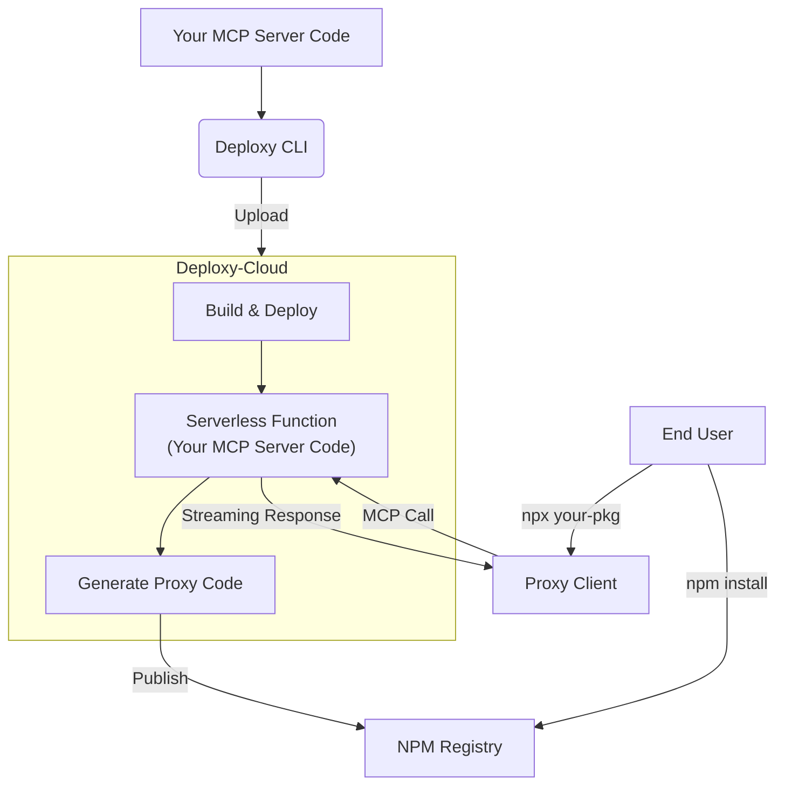

# Why Deploxy

This document explains the key concepts behind Deploxy, providing a solid foundation for understanding how the platform works.

## The Core Problem: Monetizing Public MCP Servers

The Stdio MCP server model is powerful but presents two major challenges for developers who want to build a business around their creations:

1.  **Exposed Source Code:** Publishing to NPM exposes your entire source code. This leaves your proprietary business logic and secret keys unprotected.

2.  **Bypassable Monetization:** Client-side monetization, like a credit system, is insecure. Users can simply download your code, remove the paywall, and run it for free.

### The Backend Dilemma

The traditional solution is to build a separate, private backend server to handle your sensitive business and monetization logic. However, this introduces a new set of problems:

-   **Infrastructure Complexity:** You are now responsible for building, deploying, and maintaining a scalable, secure backend.
-   **Global Latency:** While NPM can distribute your client code globally, if your backend only runs in a single region (e.g., `us-east-1`), users in other parts of the world will experience significant network lag, leading to a poor user experience.

## The Deploxy Solution: A Secure Global Backend, Simplified

Deploxy solves these fundamental problems by providing a secure, globally distributed backend for your MCP server, without the operational overhead.

When you deploy with Deploxy:
1.  **Your code stays private:** Your MCP server code, containing all your valuable business and monetization logic, is deployed to our secure, isolated cloud environment. It is **never** published to NPM.
2.  **We publish a proxy:** Deploxy automatically generates and publishes a minimal, lightweight proxy package to NPM. This is all the end-user ever interacts with.
3.  **Requests are securely routed:** The proxy client securely forwards requests from the user to your private server running on our global network.
4.  **Your logic is enforced:** Because your monetization logic (e.g., credit deduction) runs on the secure server, it cannot be bypassed by the end-user.

This architecture gives you the best of both worlds: the simplicity of NPM distribution for your users, and the security and performance of a private, globally-replicated backend for your business.

## 1. The Private MCP Server

Your MCP server is the core of your application. It contains all your valuable logic:
-   Proprietary algorithms and business logic.
-   Connections to your private databases.
-   Secure handling of API keys and other secrets.

With Deploxy, you write this code as a standard Node.js application. During deployment, this code is uploaded directly to a secure serverless environment and is **never** published to a public registry.

## 2. The Lightweight Proxy Package

When you deploy with `npx @deploxy/cli deploy`, Deploxy automatically generates a new, minimal NPM package. This is the **proxy package**.

-   **What it is:** A small, lightweight client that knows how to connect to your private MCP server.
-   **What it contains:** Only the necessary logic to forward a user's request (e.g., a tool call) to your secure server and stream the response back.
-   **What it does NOT contain:** Any of your sensitive source code, database credentials, or secret keys.

This proxy package is what you publish to NPM. Your end-users install this package, giving them access to your MCP server's functionality without ever seeing the underlying implementation.

## 3. The Serverless Architecture

Your private MCP server code runs on highly scalable and resilient serverless infrastructure (like AWS Lambda).

-   **Auto-Scaling:** The platform automatically handles traffic spikes, scaling your server up or down as needed. You don't need to manage servers.
-   **High Availability:** Serverless functions are inherently resilient, providing a stable experience for your users.
-   **Pay-per-use:** You only pay for the compute time you consume, making it a cost-effective solution.

## 4. Configuration via `.deploxy.json`

The `.deploxy.json` file is the control center for your project. It tells the Deploxy CLI everything it needs to know to deploy and manage your server.

Key settings include:
-   `authToken`: Your secret token for authenticating with the Deploxy platform.
-   `injectedEnv`: A secure map of environment variables (like `DATABASE_URL` or `API_KEY`) that are made available to your private server at runtime.
-   `defaultDeployRegion`: The geographical region where your server will be deployed, allowing you to place it closer to your users for lower latency.

## 5. The CLI-Driven Workflow

Deploxy is designed to be integrated directly into your development and CI/CD workflow via the `@deploxy/cli`.

-   `npx @deploxy/cli init`: Initializes a new project with a `.deploxy.json` file.
-   `npx @deploxy/cli deploy`: The core command that bundles your code, uploads it securely, deploys it to the serverless environment, and publishes the proxy package to NPM.

This workflow allows you to automate deployments and manage your application's lifecycle directly from your terminal or CI/CD pipeline.

---

## How Deploxy Works

The Deploxy platform follows a simple but powerful architecture:

<Steps>
  <Step title="You Write Your MCP Server">
    Build your MCP server with all your business logic, database connections, and private functionality. This runs entirely in Deploxy's secure cloud environment.
  </Step>
  <Step title="Deploy with the Deploxy CLI">
    Using our CLI tool, your code is securely uploaded to our infrastructure where it's built and deployed as a serverless function.
  </Step>
  <Step title="We Generate a Proxy Package">
    Deploxy automatically creates a lightweight NPM package that acts as a proxy to your private server. This proxy is what you'll publish for your users.
  </Step>
  <Step title="Users Install the Proxy">
    Your users install the proxy package via NPM, which seamlessly connects to your secure server without ever exposing your source code.
  </Step>
</Steps>

### Architecture Overview

Here's how Deploxy's architecture ensures both security and performance:

<Warning>
  Your source code is **never** exposed to end users. The proxy package only contains connection logic, while your business logic remains secure in Deploxy's cloud.
</Warning>

