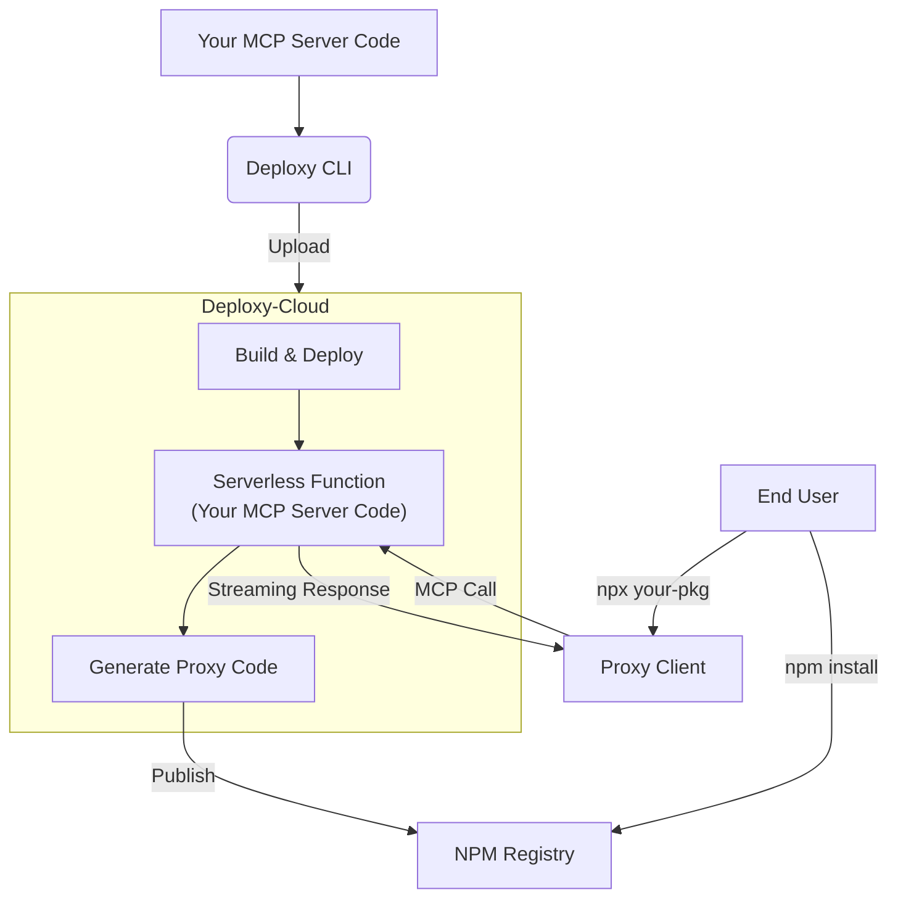

# Introduction to Deploxy

<Info>
  In this guide, you'll learn about Deploxy's core concepts, how it works, and why it's the perfect solution for deploying private MCP servers.
</Info>

Welcome to Deploxy, the platform for deploying your MCP (Model Context Protocol) servers to serverless infrastructure while keeping your source code private and secure.

## What is Deploxy?

Deploxy is a comprehensive deployment platform that allows you to:

<CardGroup cols={2}>
  <Card 
    icon="Shield" 
    title="Deploy MCP servers privately" 
    description="Your source code remains secure on our servers, never exposed to end-users."
  />
  <Card 
    icon="Globe" 
    title="Distribute lightweight proxies" 
    description="Users install minimal proxy packages from NPM that securely connect to your hosted logic."
  />
  <Card 
    icon="Zap" 
    title="Scale automatically" 
    description="Leverage serverless infrastructure that handles traffic spikes without manual intervention."
  />
  <Card 
    icon="Code" 
    title="Focus on Your Logic" 
    description="No need to build a separate backend for secure tool calls or database connections."
  />
</CardGroup>

## How It Works

The Deploxy platform follows a simple but powerful architecture:

<Steps>
  <Step title="You Write Your MCP Server">
    Build your MCP server with all your business logic, database connections, and private functionality. This runs entirely in Deploxy's secure cloud environment.
  </Step>
  <Step title="Deploy with the Deploxy CLI">
    Using our CLI tool, your code is securely uploaded to our infrastructure where it's built and deployed as a serverless function.
  </Step>
  <Step title="We Generate a Proxy Package">
    Deploxy automatically creates a lightweight NPM package that acts as a proxy to your private server. This proxy is what you'll publish for your users.
  </Step>
  <Step title="Users Install the Proxy">
    Your users install the proxy package via NPM, which seamlessly connects to your secure server without ever exposing your source code.
  </Step>
</Steps>

### Architecture Overview

Here's how Deploxy's architecture ensures both security and performance:

<Warning>
  Your source code is **never** exposed to end users. The proxy package only contains connection logic, while your business logic remains secure in Deploxy's cloud.
</Warning>

## Getting Started

Ready to deploy your first MCP server?

<QuickLinks>
  <QuickLink
    to="/getting-started/installation"
    title="Installation & Setup"
    description="Install Deploxy CLI and set up your development environment."
    icon="Download"
  />
  <QuickLink
    to="/getting-started/first-deployment"
    title="Your First Deployment"
    description="A step-by-step guide to deploy your first MCP server."
    icon="Rocket"
  />
</QuickLinks>
